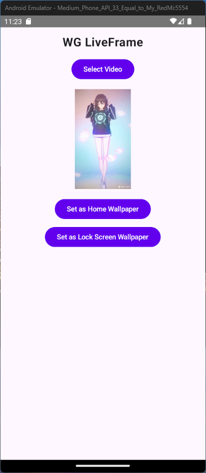

# WG LiveFrame 🎥✨

**WG LiveFrame** is an Android app that lets you set videos as live wallpapers on your home screen. Transform your device with dynamic, personalized wallpapers!

  
*Preview of the app interface.*

---

## **Features**
- Select videos from your device to use as live wallpapers.
- Play videos seamlessly on the home screen using `MediaPlayer`.
- Support for Android 13+ storage permissions (`READ_MEDIA_VIDEO`).
- Persistent video URI saved across sessions using `SharedPreferences`.

---

## **Installation**

### **Step 1: Download the APK**
Download the latest release from the [Releases](https://github.com/<username>/<repository>/releases) page:
- Latest version: [wg-liveframe-v0.1.apk](https://github.com/<username>/<repository>/releases/download/v0.1/wg-liveframe-v0.1.apk)

### **Step 2: Install the App**
1. Enable **Unknown Sources** on your device:
   - Go to **Settings > Security > Unknown Sources**.
2. Locate the downloaded APK file and tap it to install.

---

## **Usage**

### **Step 1: Select a Video**
1. Open the app and tap **Select Video**.
2. Choose a video file from your device.

### **Step 2: Preview the Video**
- The selected video will appear in the preview section.

### **Step 3: Set as Wallpaper**
1. Tap **Set as Home Wallpaper**.
2. Confirm in the live wallpaper picker.

---

## **Release Notes**

### **v0.1**
- Initial release of WG LiveFrame.
- Core functionality: Set videos as live wallpapers.
---

## **Contributing**

We welcome contributions! If you’d like to contribute to WG LiveFrame, please follow these steps:
1. Fork the repository.
2. Create a new branch (`git checkout -b feature/YourFeatureName`).
3. Commit your changes (`git commit -m "Add YourFeatureName"`).
4. Push to the branch (`git push origin feature/YourFeatureName`).
5. Open a pull request.

---

## **License**

This project is licensed under the MIT License. See the [LICENSE](LICENSE) file for details.

---
